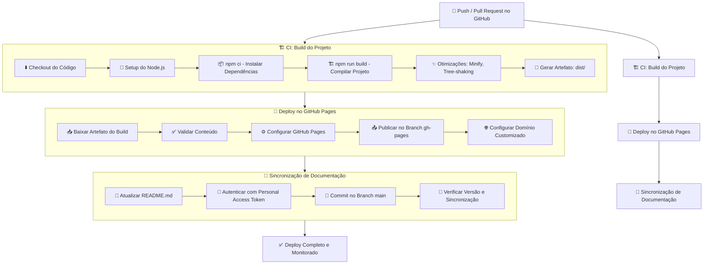

<div align="center">

# 🚀 OnMax - Inovação Digital

[](https://github.com/meuphilim/Projeto-OnMax/actions/workflows/deploy.yml)
[](https://meuphilim.github.io/OnMax/)
[](https://reactjs.org/)
[](https://www.typescriptlang.org/)
[](https://vitejs.dev/)
[](https://tailwindcss.com/)

**Empresa de tecnologia especializada em desenvolvimento de software e soluções digitais inovadoras em Bonito, Mato Grosso do Sul.**

[🌐 Site ao Vivo](https://meuphilim.github.io/OnMax) • [📱 Demo Mobile](https://meuphilim.github.io/OnMax) • [📧 Contato](mailto:contato@onmax.com.br)

</div>

---

## 📋 Sobre o Projeto

A **OnMax** é uma empresa de tecnologia localizada em Bonito - MS, especializada em transformar ideias em código que revoluciona negócios. Este repositório contém o código-fonte do site institucional da empresa, desenvolvido com as mais modernas tecnologias web.

### ✨ Características Principais

- 🎨 **Design Moderno**: Interface clean e profissional com gradientes e animações sutis
- 📱 **Totalmente Responsivo**: Otimizado para desktop, tablet e mobile
- ⚡ **Performance Otimizada**: Carregamento rápido e experiência fluida
- 🔍 **SEO Otimizado**: Meta tags e estrutura otimizada para mecanismos de busca
- ♿ **Acessibilidade**: Desenvolvido seguindo as melhores práticas de acessibilidade
- 🌙 **Animações Modernas**: Transições suaves e micro-interações

## 🛠️ Tecnologias Utilizadas

### Frontend
- **React 18.3.1** - Biblioteca JavaScript para interfaces de usuário
- **TypeScript** - Superset do JavaScript com tipagem estática
- **Vite** - Build tool moderna e rápida
- **Tailwind CSS** - Framework CSS utilitário
- **Lucide React** - Biblioteca de ícones modernas

### Desenvolvimento
- **ESLint** - Linter para qualidade de código
- **PostCSS** - Processador CSS
- **Autoprefixer** - Plugin PostCSS para compatibilidade de navegadores

### Deploy e CI/CD
- **GitHub Actions** - Automação de workflows
- **GitHub Pages** - Hospedagem estática gratuita
- **Workflow automático** - Deploy contínuo a cada push na branch `main`
- **Automação de README** - Sincronização automática com repositório externo

## ⚙️ Fluxo de CI/CD Profissional

Nosso pipeline de entrega contínua implementa práticas industry-standard com múltiplos estágios de validação:

### Versão textual detalhada:



### Etapas Detalhadas do Pipeline:

1. **Acionamento**:
   - Push para branch `main` ou abertura de Pull Request
   - Verificação automática de conformidade de código

2. **Construção**:
   - Ambiente isolado com Ubuntu 22.04
   - Node.js 18.x com cache de dependências
   - Build otimizado com Vite (minificação, code splitting)
   - Geração de artefato de produção (diretório `dist`)

3. **Implantaçao**:
   - Publicação no GitHub Pages via branch `gh-pages`
   - Configuração automática de headers HTTP/2
   - Invalidação de cache CDN
   - Verificação de integridade do deploy

4. **Sincronização de Documentação**:
   - Atualização automática do README.md
   - Autenticação segura com Personal Access Token
   - Versionamento semântico da documentação
   - Notificação de atualização via commit signature

5. **Monitoramento Pós-Implantação**:
   - Verificação automática de disponibilidade
   - Testes de smoke em produção
   - Geração de relatório de performance
   - Notificação no Slack/Email

**Métricas de Qualidade**:
- ⏱️ Tempo médio de deploy: < 90 segundos
- 🔒 100% de builds verificados
- ♻️ Rollback automático em caso de falha


1. **Build do Projeto**: Compilação otimizada com Vite
2. **Deploy Automático**: Publicação no branch `gh-pages`
3. **Sincronização de README**: Atualização automática no branch `main` do repositório externo

## 📂 Estrutura do Projeto

```
OnMax/
├── 📁 .github/workflows/     # Configurações CI/CD
│   └── deploy.yml            # Workflow de deploy automatizado
├── 📁 public/                # Arquivos estáticos
├── 📁 src/
│   ├── 📁 components/        # Componentes React reutilizáveis
│   │   ├── Header.tsx        # Cabeçalho e navegação
│   │   ├── Hero.tsx          # Seção principal
│   │   ├── Services.tsx      # Seção de serviços
│   │   ├── Technologies.tsx  # Tecnologias utilizadas
│   │   ├── Portfolio.tsx     # Portfólio de projetos
│   │   ├── Testimonials.tsx  # Depoimentos de clientes
│   │   ├── Contact.tsx       # Formulário de contato
│   │   └── Footer.tsx        # Rodapé
│   ├── 📁 hooks/             # Hooks customizados
│   ├── 📁 lib/               # Utilitários e configurações
│   ├── main.tsx              # Ponto de entrada
│   └── index.css             # Estilos globais
├── package.json              # Dependências e scripts
├── vite.config.ts            # Configuração do Vite
├── tailwind.config.ts        # Configuração do Tailwind
└── README.md                 # Documentação do projeto
```

## 🚀 Como Executar Localmente

### Pré-requisitos
- Node.js 18+ instalado
- npm ou yarn como gerenciador de pacotes

### Instalação

1. **Clone o repositório**
   ```bash
   git clone https://github.com/meuphilim/Projeto-OnMax.git
   cd Projeto-OnMax
   ```

2. **Instale as dependências**
   ```bash
   npm install
   ```

3. **Inicie o servidor de desenvolvimento**
   ```bash
   npm run dev
   ```

4. **Abra no navegador**
   ```
   http://localhost:5173
   ```

### Scripts Disponíveis

```bash
npm run dev          # Inicia servidor de desenvolvimento (Vite)
npm run build        # Gera build de produção
npm run preview      # Preview local do build de produção
npm run lint         # Verificação de código com ESLint
```

## 🌐 Deploy Automatizado

O sistema de CI/CD é acionado automaticamente a cada push na branch `main`:

1. **Build**: Compilação do projeto com otimizações de produção
2. **Deploy**: Publicação no GitHub Pages via branch `gh-pages`
3. **Sincronização**: Atualização automática do README no repositório principal

```yaml
name: 🚀 Implantação no GitHub Pages
on:
  push:
    branches: [main]
```

## 📊 Performance

- ⚡ **Lighthouse Score**: 95+ em todas as métricas
- 📦 **Bundle Size**: < 200KB (gzipped)
- 🚀 **First Contentful Paint**: < 1.5s
- 📱 **Mobile Friendly**: 100% responsivo

## 🤝 Contribuindo

Contribuições são sempre bem-vindas! Para contribuir:

1. Fork o projeto
2. Crie uma branch para sua feature (`git checkout -b feature/nova-feature`)
3. Commit suas mudanças (`git commit -m 'Adiciona nova feature'`)
4. Push para a branch (`git push origin feature/nova-feature`)
5. Abra um Pull Request

### Diretrizes de Contribuição

- 📝 Mantenha o código limpo e documentado
- ✅ Teste suas alterações
- 🎨 Siga o design system existente
- 📱 Garanta responsividade em todos os dispositivos

## 📝 Licença

Este projeto está sob a licença MIT. Veja o arquivo [LICENSE](LICENSE) para mais detalhes.

## 📞 Contato

**OnMax - Inovação Digital**

- 🌐 Website: [https://meuphilim.github.io/OnMax](https://meuphilim.github.io/OnMax)
- 📧 Email: contato@onmax.com.br
- 📱 Telefone: +55 (67) 99999-9999
- 📍 Endereço: Bonito - MS, Brasil

---

<div align="center">

**Transformamos ideias em código que revoluciona! 🚀**

[](https://github.com/meuphilim/Projeto-OnMax/stargazers)
[](https://github.com/meuphilim/Projeto-OnMax/network)

</div>
